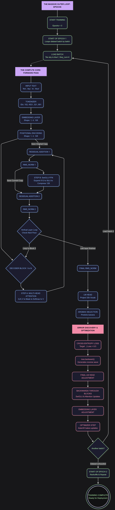

# Transformers — LLM Experiments

This repository is a cleaned-up workspace for transformer and small-language-model experiments. The goal is to keep the notebooks for exploration, move runnable code into `projects/`, and document the training loop in a way that is easy to read and extend.

<p align="center">
	
</p>

## Repository Layout

- `notebooks/` - exploratory notebooks and draft experiments.
- `projects/` - runnable Python scripts for training and generation.
- `tools/` - helper scripts for repository maintenance.
- `outputs/` - generated artifacts such as checkpoints and sample text.

## What This Repo Contains

- A tiny GPT-style language model built with PyTorch.
- A character-level Shakespeare classifier.
- Notebook-based experiments for decoder-only and GPT-style ideas.
- A visual training flow centered around `llm_training_loop.png`.

## Quick Start

1. Create a virtual environment and install the dependencies:

```bash
python -m venv .venv
.venv\Scripts\activate    # Windows PowerShell
pip install --upgrade pip
pip install -r requirements.txt
```

2. Train the tiny GPT-style model:

```bash
python projects/train_tiny_gpt.py --dataset roneneldan/TinyStories --max-steps 1000
```

3. Generate text from a saved checkpoint:

```bash
python projects/generate_text.py --checkpoint outputs/tiny_gpt.pth --prompt "One day, a small bird"
```

4. Train the Shakespeare speaker classifier:

```bash
python projects/shakespeare_classifier.py --input-file input.txt
```

## Training Flow

The image below shows the intended end-to-end training flow for the repo.


## Notes

- The scripts in `projects/` are intended to be runnable reference implementations.
- Large checkpoints and generated outputs should stay out of Git.
- The notebooks in `notebooks/` remain as exploratory work and are not required to run the project scripts.

## Contributing

- Keep changes focused and runnable.
- If you add a new experiment, put the script in `projects/` and the notebook in `notebooks/`.

