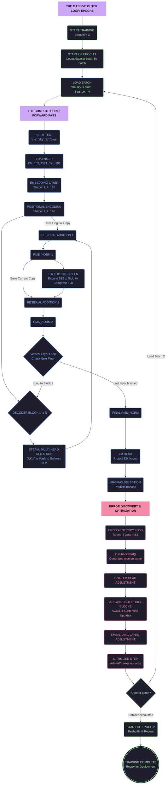

```mermaid
graph TD
    %% Color Themes & Styling
    classDef default fill:#1e1e2e,stroke:#45475a,stroke-width:2px,color:#cdd6f4
    classDef title fill:#cba6f7,stroke:#1e1e2e,stroke-width:0px,color:#11111b,font-weight:bold
    classDef epoch fill:#1e1e2e,stroke:#a6e3a1,stroke-width:2px,color:#a6e3a1
    classDef forward fill:#1e1e2e,stroke:#89b4fa,stroke-width:2px,color:#89b4fa
    classDef backward fill:#1e1e2e,stroke:#f38ba8,stroke-width:2px,color:#f38ba8
    classDef error fill:#f38ba8,stroke:#1e1e2e,stroke-width:0px,color:#11111b,font-weight:bold

    %% --- EPOCH LOOP ---
    Title1["THE MASSIVE OUTER LOOP: EPOCHS"]:::title
    Start("START TRAINING<br/>Epochs = 3"):::epoch
    Epoch1("START OF EPOCH 1<br/>Loops dataset batch by batch"):::epoch
    Batch("LOAD BATCH<br/>'the sky is blue' | Seq_Len=4"):::epoch

    %% --- FORWARD PASS ---
    Title2["THE COMPUTE CORE: FORWARD PASS"]:::title
    Input("INPUT TEXT<br/>'the', 'sky', 'is', 'blue'"):::forward
    Tok("TOKENIZER<br/>IDs: 102, 4521, 321, 891"):::forward
    Embed("EMBEDDING LAYER<br/>Shape: 1, 4, 128"):::forward
    RoPE("POSITIONAL ENCODING<br/>Shape: 1, 4, 128"):::forward

    BlockStart{"DECODER BLOCK 1 to N"}:::forward
    MHA("STEP A: MULTI-HEAD ATTENTION<br/>Q,K,V to Mask to Softmax to V"):::forward
    Add1("RESIDUAL ADDITION 1"):::forward
    Norm1("RMS_NORM 1"):::forward
    FFN("STEP B: SwiGLU FFN<br/>Expand 512 to SiLU to Compress 128"):::forward
    Add2("RESIDUAL ADDITION 2"):::forward
    Norm2("RMS_NORM 2"):::forward

    LayerLoop{"Vertical Layer Loop<br/>Check Next Floor"}:::forward
    FinalNorm("FINAL RMS_NORM"):::forward
    LMHead("LM HEAD<br/>Project 32k Vocab"):::forward
    Predict("ARGMAX SELECTION<br/>Predicts banana"):::forward

    %% --- BACKPROPAGATION ---
    Title3["ERROR DISCOVERY & OPTIMIZATION"]:::error
    Loss("CROSS-ENTROPY LOSS<br/>Target . | Loss = 8.5"):::backward
    Backprop("loss.backward()<br/>Generates reverse wave"):::backward
    AdjLM("FINAL LM HEAD ADJUSTMENT"):::backward
    AdjBlock("BACKWARDS THROUGH BLOCKS<br/>SwiGLU & Attention Updates"):::backward
    AdjEmbed("EMBEDDING LAYER ADJUSTMENT"):::backward
    Opt("OPTIMIZER STEP<br/>AdamW bakes updates"):::backward

    NextBatch{"Another batch?"}:::epoch
    Epoch2("START OF EPOCH 2<br/>Reshuffle & Repeat"):::epoch
    Done((("TRAINING COMPLETE<br/>Ready for Deployment"))):::epoch

    %% --- CONNECTIONS ---
    Title1 --- Start
    Start --> Epoch1 --> Batch
    Batch -.-> Title2
    Title2 --- Input
    Input --> Tok --> Embed --> RoPE
    
    %% Residual Highway 1
    RoPE -->|"Save Original Copy"| Add1
    RoPE --> BlockStart --> MHA --> Add1 --> Norm1
    
    %% Residual Highway 2
    Norm1 -->|"Save Current Copy"| Add2
    Norm1 --> FFN --> Add2 --> Norm2 --> LayerLoop
    
    LayerLoop -->|"Loop to Block 2"| BlockStart
    LayerLoop -->|"Last layer finished"| FinalNorm
    
    FinalNorm --> LMHead --> Predict
    
    Predict -.-> Title3
    Title3 --- Loss
    Loss --> Backprop --> AdjLM --> AdjBlock --> AdjEmbed --> Opt
    
    Opt --> NextBatch
    NextBatch -->|"Load Batch 2"| Batch
    NextBatch -->|"Dataset exhausted"| Epoch2
    Epoch2 --> Done
```